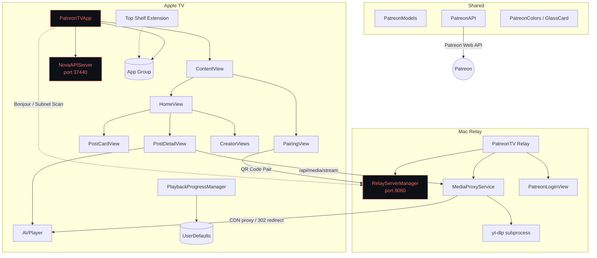

# PatreonTV


[](https://opensource.org/licenses/MIT)


Watch your favorite Patreon creators on Apple TV.

PatreonTV is a native tvOS application that lets you browse and watch content from Patreon creators you support. A companion macOS app -- PatreonTV Relay -- handles authentication and acts as a local media proxy server, resolving Patreon CDN redirects, extracting YouTube and Vimeo streams via yt-dlp, and proxying video and audio to the Apple TV over your local network. No data ever leaves your LAN.

**Current Versions**: PatreonTV v3.0.0 (tvOS) | PatreonTV Relay v2.0.0 (macOS)

---

## Architecture

```
+---------------------------------------------------------------+
|                         LOCAL NETWORK                         |
|                                                               |
|   +-------------------+            +------------------------+ |
|   |    Apple TV        |           |   Mac (Relay Server)    | |
|   |    (tvOS app)      |           |   Port 8080             | |
|   |                    |           |                         | |
|   |  1. Bonjour browse | --------> | _patreontv._tcp         | |
|   |     (or subnet     |           | Bonjour advertise       | |
|   |      scan :8080)   |           |                         | |
|   |                    |           |                         | |
|   |  2. QR code pair   | --------> | /pair/<code>            | |
|   |     display code   |           | Opens native WebView    | |
|   |     on screen      |           | User logs into Patreon  | |
|   |                    | <-------- | session_id returned     | |
|   |     Keychain store |           |                         | |
|   |                    |           |                         | |
|   |  3. Browse feed    |           |                         | |
|   |     Patreon API    | --------> | (direct or proxied)     | |
|   |     /api/stream    |           |                         | |
|   |                    |           |                         | |
|   |  4. Play media     |           |                         | |
|   |  GET /api/media/   | --------> | Resolve media URL:      | |
|   |    stream/<postID> |           |                         | |
|   |                    |           | +---------------------+ | |
|   |                    |           | | Patreon video/audio | | |
|   |                    |           | | Follow redirect     | | |
|   |                    |           | | with session cookie  | | |
|   |                    |           | | -> CDN URL          | | |
|   |                    |           | +---------------------+ | |
|   |                    |           |                         | |
|   |                    |           | +---------------------+ | |
|   |                    |           | | YouTube / Vimeo     | | |
|   |                    |           | | yt-dlp extraction   | | |
|   |                    |           | | -> direct stream    | | |
|   |                    |           | | (302 redirect to    | | |
|   |                    |           | |  HLS for AVPlayer)  | | |
|   |                    |           | +---------------------+ | |
|   |                    |           |                         | |
|   |  AVPlayer <------- | <======== | Proxy: HTTP headers +  | |
|   |  renders stream    |  chunked  | body chunks streamed   | |
|   |                    |  stream   | (Range/seek supported)  | |
|   +-------------------+            +------------------------+ |
|                                                               |
|   +-------------------+                                       |
|   | Top Shelf Ext.    |  Reads shared App Group container     |
|   | Recent posts on   |  (group.com.jordankoch.patreontv)    |
|   | Apple TV home     |  Deep links via patreontv://post/<id>|
|   +-------------------+                                       |
+---------------------------------------------------------------+
                              |
                     NO traffic leaves
                      the local network
```

### Relay Discovery

The Apple TV finds the Mac relay server automatically through two mechanisms:

1. **Bonjour** -- The relay publishes a `_patreontv._tcp` service with host and port in its TXT record. The Apple TV browses for this service and resolves the endpoint.
2. **Subnet fallback** -- If Bonjour does not respond within 3 seconds, the Apple TV concurrently probes `192.168.1.1` through `192.168.1.254` on port 8080, hitting the `/health` endpoint. The first host that responds with `"ok"` wins.

No manual IP configuration is required.

### Media Proxy Pipeline

When the Apple TV requests media playback, the relay resolves the content URL and either proxies or redirects:

- **Patreon-hosted video/audio** -- The relay follows the Patreon download URL redirect with the session cookie attached, captures the CDN URL, then proxies the upstream response chunk-by-chunk to the Apple TV. HTTP Range headers are forwarded for seek support.
- **YouTube/Vimeo embeds** -- The relay runs yt-dlp as a subprocess to extract a direct stream URL, then issues a 302 redirect to the Apple TV. AVPlayer handles HLS natively from the CDN.
- **URL caching** -- Resolved URLs are cached for 5 minutes (TTL) to minimize latency on seek operations and repeated requests.

---

## Features

### tvOS App (PatreonTV)
- Native SwiftUI Apple TV interface with glassmorphic design system
- Home feed with infinite scroll (cursor-based pagination)
- Creator filter chips -- filter the feed by specific creator
- Creator list view with grid layout
- Video playback via AVPlayer (Patreon-hosted, YouTube, Vimeo)
- Audio playback (Patreon-hosted podcasts and audio files)
- Image viewing and text post reading with HTML rendering
- Continue Watching -- saves and resumes playback position automatically
- Top Shelf extension showing recent posts on the Apple TV home screen
- Deep linking via `patreontv://` URL scheme (Top Shelf to post detail)
- QR code pairing flow for authentication
- Session persistence in Keychain
- Debug logging (file-based, accessible from the app)

### macOS App (PatreonTV Relay)
- Local HTTP server on port 8080 with Bonjour service advertisement
- Native WebView login window for Patreon authentication (no browser cookie extraction)
- Media proxy server -- streams video and audio to Apple TV with Range/seek support
- Patreon CDN redirect resolution with session cookie authentication
- YouTube and Vimeo stream extraction via yt-dlp subprocess
- Anti-detection measures: 7 rotating user agents, web player client, browser-like Referer headers
- URL caching with 5-minute TTL
- Dashboard UI showing active streams, bytes proxied, yt-dlp status, and cache statistics
- Session validation and re-login support
- Hardened Runtime enabled
- No sandbox -- full network server/client access and subprocess execution

### Top Shelf Extension
- Displays up to 10 recent posts on the Apple TV home screen
- Shows post thumbnails and titles from the user's feed
- Tap to deep link directly into the post detail view
- Data shared via App Group container (`group.com.jordankoch.patreontv`)

### General
- Zero external Swift package dependencies -- all native Apple frameworks
- No cloud services -- all communication stays on the local network
- Session tokens stored in Keychain (tvOS) and validated on restore

---

## Project Structure

```
PatreonTV/
|-- Shared/                              Shared code across all targets
|   |-- Design/
|   |   |-- PatreonColors.swift          Color palette and theme constants
|   |   |-- GlassCard.swift              Glassmorphic card ViewModifier
|   |   +-- GlassmorphicBackground.swift Animated gradient background
|   |-- Models/
|   |   +-- PatreonModels.swift          Data models (Post, Campaign, User, Pairing, etc.)
|   +-- Services/
|       +-- PatreonAPI.swift             Patreon web API client (feed, posts, memberships)
|
|-- PatreonTV/                           tvOS app target
|   |-- App/
|   |   |-- PatreonTVApp.swift           App entry, AuthManager, Bonjour discovery, KeychainService
|   |   |-- AIBackendManager.swift       AI backend integration manager
|   |   +-- AIBackendStatusMenu.swift    AI backend status UI
|   |-- Views/
|   |   |-- ContentView.swift            Root view (auth gate)
|   |   |-- HomeView.swift               Tab bar: Feed, Creators, Settings + HomeViewModel
|   |   |-- PostCardView.swift           Post card component for feed
|   |   |-- PostDetailView.swift         Full post view with media playback
|   |   |-- CreatorViews.swift           Creator card, creator detail, campaign posts
|   |   +-- PairingView.swift            QR code pairing UI
|   |-- Services/
|   |   +-- PlaybackProgressManager.swift  Continue Watching persistence
|   +-- NovaAPIServer.swift              Local API server (port 37440) for automation
|
|-- PatreonTV Relay/                     macOS relay server target
|   |-- App/
|   |   +-- PatreonTVRelayApp.swift      App entry, AppDelegate, auto-start server
|   |-- Views/
|   |   |-- RelayServerView.swift        Dashboard UI (streams, stats, logs)
|   |   +-- PatreonLoginView.swift       Native WebView for Patreon login
|   +-- Services/
|       |-- RelayServerManager.swift     HTTP server, routing, Bonjour, media proxy orchestration
|       +-- MediaProxyService.swift      URL resolution, yt-dlp, redirect capture, caching
|
|-- PatreonTV Top Shelf/                 tvOS Top Shelf extension
|   +-- ContentProvider.swift            Recent posts for Apple TV home screen
|
|-- project.yml                          XcodeGen project specification
+-- PatreonTV.xcodeproj/                 Generated Xcode project
```

**3 targets** | **22 Swift files** | **~5,300 lines of code** | **Zero external dependencies**

---

## Installation

### Prerequisites

- Apple TV (4th generation or later) running tvOS 17.0+
- Mac running macOS 14.0+ (Sonoma or later) for the Relay server
- Patreon account with active subscriptions
- yt-dlp installed on the Mac (`brew install yt-dlp`) -- required for YouTube/Vimeo playback

### Setup

1. **Install PatreonTV Relay on your Mac**
   - Copy `PatreonTV Relay.app` to your Applications folder
   - Launch the app -- the local server starts automatically on port 8080
   - Verify the dashboard shows "yt-dlp: Available"
   - Note the server URL displayed (e.g., `http://192.168.1.100:8080`)

2. **Install PatreonTV on Apple TV**
   - Build and deploy from Xcode, or install via TestFlight if available

3. **Connect Your Account**
   - Launch PatreonTV on your Apple TV
   - Select "Pair with Your Mac"
   - A 6-character pairing code and QR code appear on screen
   - Scan the QR code with your phone or navigate to the displayed URL
   - A native login window opens on your Mac -- log in to Patreon
   - The Apple TV connects automatically once authentication completes

---

## Building from Source

### Requirements

- Xcode 16.0+
- macOS 14.0+ (Sonoma)
- yt-dlp (`brew install yt-dlp`)
- XcodeGen (optional, only needed to regenerate the project from `project.yml`): `brew install xcodegen`

### Build Steps

```bash
cd /path/to/PatreonTV
open PatreonTV.xcodeproj
```

Then in Xcode:

- **PatreonTV (tvOS)**: Select the PatreonTV scheme, choose your Apple TV as the destination, and build.
- **PatreonTV Relay (macOS)**: Select the PatreonTV Relay scheme and build for Mac.

To regenerate the Xcode project from the spec:

```bash
xcodegen generate
```

---

## Security

- **Local Network Only** -- The relay server binds to your LAN. No data is sent to external servers.
- **No Cloud Services** -- Authentication, session management, and media streaming all happen between your Apple TV and your Mac.
- **Keychain Storage** -- Session tokens are stored in the tvOS Keychain using `SecItemAdd`/`SecItemCopyMatching`.
- **App Transport Security** -- `NSAllowsLocalNetworking` permits local HTTP communication; arbitrary loads are not enabled for external hosts.
- **Hardened Runtime** -- Enabled on the macOS relay app.
- **No Sandbox** -- The macOS relay requires full network server/client access and yt-dlp subprocess execution, so the sandbox is disabled.
- **Session Expiry** -- Patreon sessions expire naturally. The relay validates sessions on launch and supports re-authentication from the dashboard.
- **yt-dlp Anti-Detection** -- Rotated user agents (7 browser strings), web player client extraction, and browser-like Referer headers reduce YouTube throttling.
- **Pairing Codes** -- 6-character codes use an unambiguous character set (no 0/O or 1/I confusion) and expire after 5 minutes.
- **Loopback API** -- The Nova/Claude API server binds to 127.0.0.1 only, preventing external access.

---

## Technical Details

### Supported Post Types

| Type | Source | Playback Method |
|---|---|---|
| Video (Patreon-hosted) | `video_embed`, `video_external_file` | Relay proxies CDN stream to AVPlayer |
| Video (YouTube) | Embed URL containing `youtube.com` or `youtu.be` | yt-dlp extracts HLS URL, relay 302 redirects |
| Video (Vimeo) | Embed URL containing `vimeo.com` | yt-dlp extracts stream URL, relay 302 redirects |
| Audio (Patreon-hosted) | `audio_file`, `audio_embed` | Relay proxies CDN stream to AVPlayer |
| Image | `image_file` | Direct display in tvOS image viewer |
| Text | `text_only` | HTML-rendered content view |
| Link | `link` | Displayed as text with URL |
| Livestream | `livestream`, `livestream_youtube` | yt-dlp or direct embed |

### API Endpoints (Relay Server)

| Endpoint | Method | Description |
|---|---|---|
| `/health` | GET | Health check with session status |
| `/pair/<code>` | GET | QR code landing page, triggers native login |
| `/api/pairing/register` | POST | Register a new pairing session |
| `/api/pairing/status/<code>` | GET | Poll pairing session status |
| `/api/pairing/complete/<code>` | POST | Complete pairing with session token |
| `/api/session/status` | GET | Current Patreon session validity |
| `/api/session/relogin` | POST | Trigger re-authentication window |
| `/api/media/stream/<postID>` | GET | Stream or redirect media for a post |

### Query Parameters for Media Streaming

The Apple TV passes media URLs it already has from the feed data as query parameters on the `/api/media/stream/<postID>` endpoint:

- `video_url` -- Patreon-hosted video download URL
- `audio_url` -- Patreon-hosted audio download URL
- `embed_url` -- YouTube/Vimeo embed URL
- `type` -- Post type hint
- `sid` -- Session ID (fallback; relay prefers its own stored session)

### Key Design Decisions

- **Relay-based architecture**: Patreon CDN URLs require session cookies for redirect resolution, which tvOS cannot handle directly. The relay on macOS has full network capabilities.
- **Proxy vs. redirect**: Patreon CDN streams are proxied (the relay forwards chunks) because the CDN requires cookie-based authentication. YouTube/Vimeo HLS streams are redirected (302) because AVPlayer handles HLS natively and proxying HLS manifests breaks segment URL resolution.
- **yt-dlp as subprocess**: yt-dlp runs as an external process rather than being embedded, allowing users to update it independently via Homebrew to stay ahead of YouTube changes.
- **Feed-first URL passing**: The Apple TV extracts media URLs from feed data and passes them to the relay as query parameters, avoiding a redundant Patreon API call that may return 403.
- **App Group for Top Shelf**: The main app writes recent posts to a shared App Group container so the Top Shelf extension can display them without its own network access.

### Frameworks Used

- **SwiftUI** -- All UI on both tvOS and macOS
- **Network (NWListener, NWConnection, NWBrowser)** -- HTTP server, Bonjour discovery, TCP connections
- **TVServices** -- Top Shelf extension
- **AVKit / AVFoundation** -- Video and audio playback
- **Security** -- Keychain storage for session tokens
- **Foundation** -- URL sessions, JSON encoding/decoding, Process (yt-dlp subprocess)

---

## Troubleshooting

### "Could not connect to relay server"
- Verify PatreonTV Relay is running on your Mac
- Confirm your Mac and Apple TV are on the same network
- Check if any firewall is blocking port 8080

### "Pairing code expired"
- Codes expire after 5 minutes
- Cancel and start a new pairing session

### Video not playing
- Verify the relay dashboard shows "yt-dlp: Available"
- For YouTube content, update yt-dlp: `brew upgrade yt-dlp`
- Check the relay server logs in the dashboard for error details

### yt-dlp not detected
- Install: `brew install yt-dlp`
- Update: `brew upgrade yt-dlp`
- The relay checks `/opt/homebrew/bin/yt-dlp` and `/usr/local/bin/yt-dlp` at launch

### Relay not discoverable
- Both devices must be on the same subnet (default scan range: `192.168.1.x`)
- Verify the relay dashboard shows "Server started on port 8080"
- Check that Bonjour/mDNS is not blocked by your router

---

## Nova / Claude API Integration

PatreonTV exposes a local HTTP API on port **37440** for integration with Nova (OpenClaw AI) and Claude Code. The server binds to loopback only (127.0.0.1) -- no external network exposure.

```bash
# Health check
curl http://127.0.0.1:37440/api/ping

# App status and uptime
curl http://127.0.0.1:37440/api/status
```

The API server starts automatically when the app launches.

---

## Architecture (Mermaid)



---

## Testing

The test suite (`PatreonTVTests`) validates data models, parsing, codable conformance, and security. Run tests via Xcode or the command line:

```bash
xcodebuild test -scheme PatreonTV -sdk appletvsimulator -destination 'platform=tvOS Simulator,name=Apple TV 4K (3rd generation)'
```

### Test Coverage

| Category | Tests | What's Covered |
|----------|-------|----------------|
| **PatreonUser** | 3 | Initialization, full decoding, missing-field defaults |
| **PatreonCampaign** | 3 | Initialization, missing-name fallback, full decoding |
| **PatreonPost** | 5 | Initialization, displayTitle fallback, previewText (HTML strip, truncation), media detection, PostType classification |
| **PatreonAttachment** | 4 | Image/video/audio detection via mediaType, nil safety |
| **PairingSession** | 5 | Code generation (length, no confusable chars, uniqueness), expiry logic, initial state |
| **AnyCodable** | 4 | String, Int, Bool, Double round-trip encoding |
| **Pagination** | 2 | Full and empty pagination decoding |
| **Security** | 4 | No hardcoded API keys, loopback-only API, pairing code safety, no tokens in UserDefaults |
| **Total** | **30** | |

---

## License

MIT License -- see [LICENSE](LICENSE) for full text.

Copyright (c) 2026 Jordan Koch.

---

## Disclaimer

This is an unofficial app and is not affiliated with or endorsed by Patreon. Use at your own risk and in accordance with Patreon's Terms of Service.

This is a personal project created on personal time. It is not affiliated with, endorsed by, or representative of any employer.

---

Written by Jordan Koch ([kochj23](https://github.com/kochj23)).
